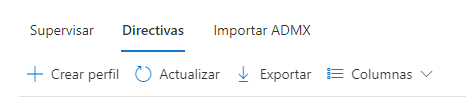
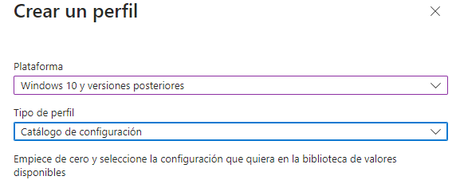
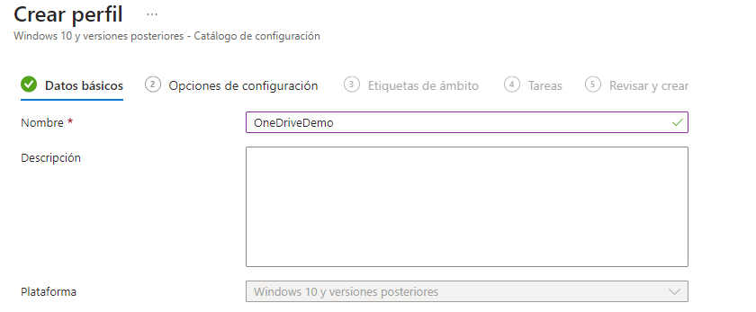
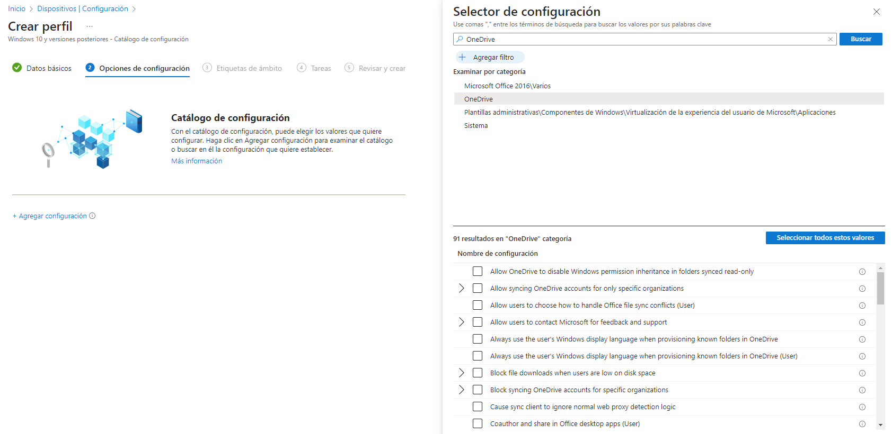
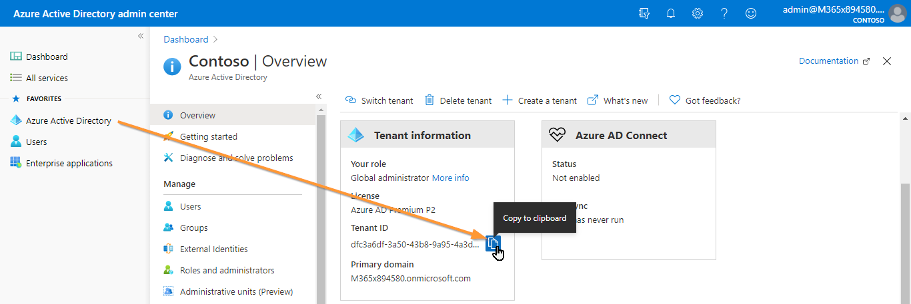
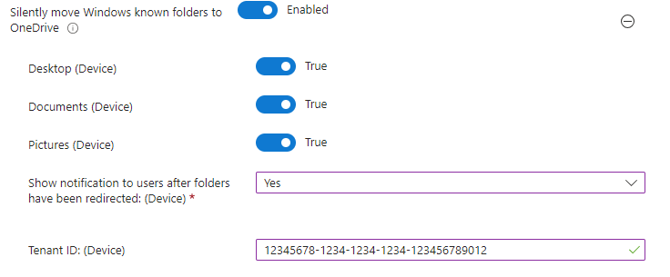

Dispositivos | Configuración
https://endpoint.microsoft.com/#view/Microsoft_Intune_DeviceSettings/DevicesMenu/~/configuration

## ONE DRIVE

Para lograr la sincronización automática de OneDrive, es necesario aplicar las directivas. Para crear una directiva, accedemos al enlace ubicado en la parte superior y seleccionamos la opción "Crear Perfil".

Al seleccionar "Crear Perfil", aparecerá una ventana emergente en la cual debemos especificar los siguientes detalles: en el campo **Plataforma**, elegiremos "Windows 10 y versiones posteriores", y en el campo **Tipo de perfil**, seleccionaremos "Catálogo de configuración".

Una vez que hayamos configurado estas opciones, hacemos clic en "Crear" y pasaremos a la siguiente pantalla.

En esta etapa, ingresamos el nombre con el que deseamos identificar la directiva y proporcionamos una breve descripción.

ahora tenemos que pulsar en  **Agregar configuración** y buscar "OneDrive" en el buscador

En esta sección, debemos buscar las siguientes opciones:

- Silently move Windows known folders to OneDrive
- Silently sign in users to the OneDrive sync app with their Windows credentials
- Allow syncing OneDrive accounts for only specific organizations.
- Set the sync app update ring
- Use OneDrive Files On-Demand

Para configurar algunas de estas opciones, necesitaremos el **Tenant ID** de la organización. Para obtenerlo, simplemente accedemos al Active Directory y lo copiamos tal como se muestra en la imagen.

A continuación, explicaré brevemente para qué sirve cada opción y cómo se configura.

## Silently move Windows known folders to OneDrive

Esta configuración permite la sincronización automática de las carpetas de Escritorio, Documentos e Imágenes sin la intervención del usuario. Además, se puede mostrar una notificación para informar al usuario cuando estas carpetas se hayan sincronizado exitosamente.

Es importante poner el Tenant ID para la sincronizacion ya que si no no se van a sincronizar las carpetas.

## Silently sign in users to the OneDrive sync app with their Windows credentials

Esta configuración te permite iniciar sesión de forma silenciosa a los usuarios en la aplicación de sincronización de OneDrive (OneDrive.exe) con sus credenciales de Windows. Si habilitas esta configuración, los usuarios que hayan iniciado sesión en el PC con la cuenta principal de Windows (la cuenta utilizada para unir el PC al dominio) podrán configurar la aplicación de sincronización sin tener que ingresar las credenciales de la cuenta. Los usuarios aún verán la configuración inicial de OneDrive para que puedan seleccionar las carpetas a sincronizar y cambiar la ubicación de su carpeta de OneDrive. Si un usuario está utilizando la aplicación de sincronización anterior de OneDrive for Business (Groove.exe), la nueva aplicación de sincronización intentará tomar el control de la sincronización de OneDrive del usuario desde la aplicación anterior y conservar los ajustes de sincronización del usuario. Esta configuración se utiliza con frecuencia junto con "Establecer el tamaño máximo de descarga automática de OneDrive para un usuario" en PC que no tienen "Archivos bajo demanda" y "Establecer la ubicación predeterminada de la carpeta de OneDrive". Si deshabilitas o no configuras esta configuración, los usuarios deberán iniciar sesión con su cuenta de trabajo o de estudios para configurar la sincronización.

### Allow syncing OneDrive accounts for only specific organizations. (no es indispensable)

Esta configuración te permite evitar que los usuarios suban fácilmente archivos a otras organizaciones al especificar una lista de ID de inquilinos permitidos. Si habilitas esta configuración, los usuarios recibirán un error si intentan agregar una cuenta de una organización no permitida. Si un usuario ya ha agregado la cuenta, los archivos dejarán de sincronizarse. Si deshabilitas o no configuras esta configuración, los usuarios podrán agregar cuentas de cualquier organización. Para bloquear organizaciones específicas, utiliza "Bloquear la sincronización de cuentas de OneDrive para organizaciones específicas". Esta configuración tendrá prioridad sobre "Bloquear la sincronización de cuentas de OneDrive para organizaciones específicas". No habilites ambas políticas al mismo tiempo.

## Set the sync app update ring (no es indispensable)

as actualizaciones de la aplicación de sincronización de OneDrive (OneDrive.exe) se lanzan al público a través de tres anillos: primero, Insiders; luego, Production; y finalmente, Deferred. Esta configuración te permite especificar la versión de la aplicación de sincronización para los usuarios de tu organización. Cuando habilitas esta configuración y seleccionas un anillo, los usuarios no podrán cambiarlo. Los usuarios en el anillo Insiders recibirán versiones que les permiten obtener un avance de las nuevas funciones que llegarán a OneDrive. Los usuarios en el anillo Production recibirán las últimas características a medida que estén disponibles. Los usuarios en el anillo Deferred recibirán las nuevas funciones, correcciones de errores y mejoras de rendimiento en último lugar. Este anillo te permite implementar actualizaciones desde una ubicación de red interna y controlar el momento de la implementación (dentro de una ventana de 60 días). Si deshabilitas o no configuras esta configuración, los usuarios recibirán las actualizaciones de la aplicación de sincronización de OneDrive cuando estén disponibles en el anillo Production. Los usuarios pueden unirse a los programas Office o Windows Insiders para recibir actualizaciones en el anillo Insiders.

## Use OneDrive Files On-Demand (no es indispensable)
Esta configuración te permite controlar si se habilita OneDrive Archivos bajo demanda para tu organización. Si habilitas esta configuración, OneDrive Archivos bajo demanda se activará de forma predeterminada. Si deshabilitas esta configuración, OneDrive Archivos bajo demanda se desactivará explícitamente y los usuarios no podrán activarlo. Si no configuras esta opción, los usuarios podrán activar o desactivar OneDrive Archivos bajo demanda.

