# **Directivas**
<div style="text-align: justify">
En este documento, se proporciona una guía para configurar diferentes aspectos en los dispositivos utilizando las herramientas y directivas de Microsoft Intune. Se abordarán tres áreas principales: OneDrive, SharePoint y Wi-Fi.

La sección de OneDrive explora cómo lograr la sincronización automática de OneDrive mediante la creación de perfiles de configuración. Se detallará el proceso de configuración de opciones clave, como la sincronización automática de carpetas conocidas de Windows y la autenticación silenciosa de usuarios.

En la sección de SharePoint, se explicará cómo configurar automáticamente la sincronización de una biblioteca de SharePoint utilizando directivas de Intune. Además, se proporcionará una manera de acelerar el proceso de sincronización utilizando un script de PowerShell.

Por último, se abordará la configuración de Wi-Fi, donde se mostrará cómo aplicar las credenciales y configuraciones de red a través de directivas de Intune.

A través de estas instrucciones detalladas, podrás optimizar la configuración de tus dispositivos y aprovechar al máximo las capacidades Microsoft Intune
</div>
## Indice
- [ONE DRIVE](#one-drive)
- [OneDrive Sharepoint](#onedrive-sharepoint)
    - [Acelerar el proceso de sincronización](#acelerar-el-proceso-de-sincronizacion)
- [Wifi](#wi-fi)


Dispositivos | Configuración
https://endpoint.microsoft.com/#view/Microsoft_Intune_DeviceSettings/DevicesMenu/~/configuration

## ONE DRIVE

Para lograr la sincronización automática de OneDrive, es necesario aplicar las directivas. Para crear una directiva, accedemos al enlace ubicado en la parte superior y seleccionamos la opción "Crear Perfil".

<div style="text-align: center"></div>

Al seleccionar "Crear Perfil", se abrirá una ventana emergente en la cual se deben especificar los siguientes detalles: 

En el campo **Plataforma**, se debe elegir "Windows 10 y versiones posteriores", y en el campo **Tipo de perfil**, se seleccionará "Catálogo de configuración".


Una vez que hayamos configurado estas opciones, hacemos clic en "Crear" y pasaremos a la siguiente pantalla.

En esta etapa, ingresamos el nombre con el que deseamos identificar la directiva y proporcionamos una breve descripción.


Ahora es necesario hacer clic en "Agregar configuración" y buscar la opción de "OneDrive" utilizando el buscador.


En esta sección, se deben buscar las siguientes opciones:

- Silently move Windows known folders to OneDrive
- Silently sign in users to the OneDrive sync app with their Windows credentials
- Allow syncing OneDrive accounts for only specific organizations.
- Set the sync app update ring
- Use OneDrive Files On-Demand

Para configurar algunas de estas opciones, se requerirá el **ID de inquilino** (Tenant ID) de la organización. Para obtenerlo, simplemente se debe acceder al Active Directory y copiarlo tal como se muestra en la imagen.


A continuación, se proporcionará una breve explicación de cada opción y cómo se configura:


## Silently move Windows known folders to OneDrive

Esta configuración permite la sincronización automática de las carpetas de Escritorio, Documentos e Imágenes sin la intervención del usuario. Además, se puede mostrar una notificación para informar al usuario cuando estas carpetas se hayan sincronizado exitosamente.


La inclusión del Tenant ID es fundamental para garantizar la sincronización adecuada de las carpetas. No proporcionar el Tenant ID puede ocasionar problemas en el proceso de sincronización.


## Silently sign in users to the OneDrive sync app with their Windows credentials

Esta configuración te permite iniciar sesión de forma silenciosa a los usuarios en la aplicación de sincronización de OneDrive (OneDrive.exe) con sus credenciales de Windows. Si habilitas esta configuración, los usuarios que hayan iniciado sesión en el PC con la cuenta principal de Windows (la cuenta utilizada para unir el PC al dominio) podrán configurar la aplicación de sincronización sin tener que ingresar las credenciales de la cuenta. Los usuarios aún verán la configuración inicial de OneDrive para que puedan seleccionar las carpetas a sincronizar y cambiar la ubicación de su carpeta de OneDrive. Si un usuario está utilizando la aplicación de sincronización anterior de OneDrive for Business (Groove.exe), la nueva aplicación de sincronización intentará tomar el control de la sincronización de OneDrive del usuario desde la aplicación anterior y conservar los ajustes de sincronización del usuario. Esta configuración se utiliza con frecuencia junto con "Establecer el tamaño máximo de descarga automática de OneDrive para un usuario" en PC que no tienen "Archivos bajo demanda" y "Establecer la ubicación predeterminada de la carpeta de OneDrive". Si deshabilitas o no configuras esta configuración, los usuarios deberán iniciar sesión con su cuenta de trabajo o de estudios para configurar la sincronización.

## Allow syncing OneDrive accounts for only specific organizations. (no es indispensable)

Esta configuración te permite evitar que los usuarios suban fácilmente archivos a otras organizaciones al especificar una lista de ID de inquilinos permitidos. Si habilitas esta configuración, los usuarios recibirán un error si intentan agregar una cuenta de una organización no permitida. Si un usuario ya ha agregado la cuenta, los archivos dejarán de sincronizarse. Si deshabilitas o no configuras esta configuración, los usuarios podrán agregar cuentas de cualquier organización. Para bloquear organizaciones específicas, utiliza "Bloquear la sincronización de cuentas de OneDrive para organizaciones específicas". Esta configuración tendrá prioridad sobre "Bloquear la sincronización de cuentas de OneDrive para organizaciones específicas". No habilites ambas políticas al mismo tiempo.

## Set the sync app update ring (no es indispensable)

as actualizaciones de la aplicación de sincronización de OneDrive (OneDrive.exe) se lanzan al público a través de tres anillos: primero, Insiders; luego, Production; y finalmente, Deferred. Esta configuración te permite especificar la versión de la aplicación de sincronización para los usuarios de tu organización. Cuando habilitas esta configuración y seleccionas un anillo, los usuarios no podrán cambiarlo. Los usuarios en el anillo Insiders recibirán versiones que les permiten obtener un avance de las nuevas funciones que llegarán a OneDrive. Los usuarios en el anillo Production recibirán las últimas características a medida que estén disponibles. Los usuarios en el anillo Deferred recibirán las nuevas funciones, correcciones de errores y mejoras de rendimiento en último lugar. Este anillo te permite implementar actualizaciones desde una ubicación de red interna y controlar el momento de la implementación (dentro de una ventana de 60 días). Si deshabilitas o no configuras esta configuración, los usuarios recibirán las actualizaciones de la aplicación de sincronización de OneDrive cuando estén disponibles en el anillo Production. Los usuarios pueden unirse a los programas Office o Windows Insiders para recibir actualizaciones en el anillo Insiders.


## Use OneDrive Files On-Demand (no es indispensable)
Esta configuración te permite controlar si se habilita OneDrive Archivos bajo demanda para tu organización. Si habilitas esta configuración, OneDrive Archivos bajo demanda se activará de forma predeterminada. Si deshabilitas esta configuración, OneDrive Archivos bajo demanda se desactivará explícitamente y los usuarios no podrán activarlo. Si no configuras esta opción, los usuarios podrán activar o desactivar OneDrive Archivos bajo demanda.


------


Una vez completada la configuración, se debe hacer clic en "Siguiente" hasta llegar a la sección de Tareas. En esa sección, es posible asignar las directivas únicamente a grupos y no a usuarios específicos.

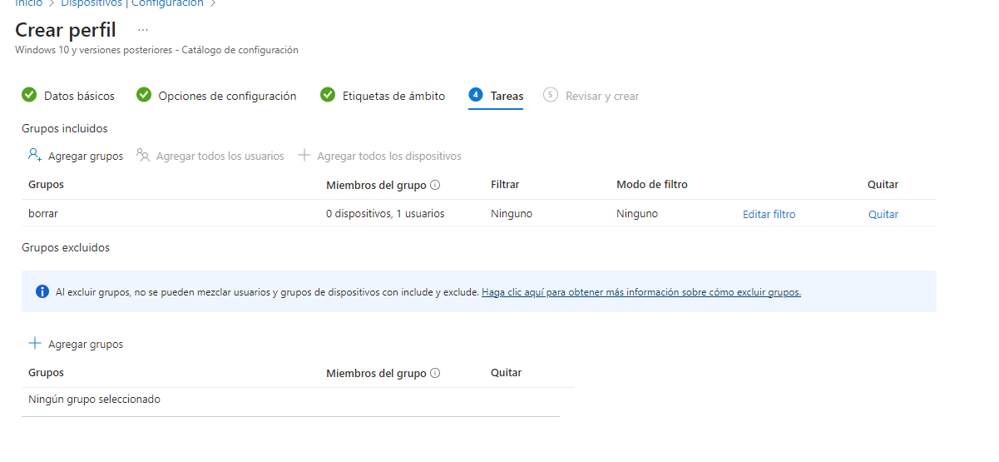

Al final del proceso, se mostrará un resumen detallado de todas las configuraciones realizadas.

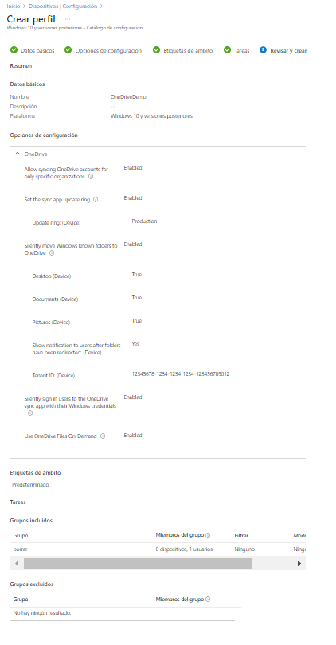

## OneDrive Sharepoint 

A continuación, se explicará cómo configurar automáticamente una unidad de SharePoint utilizando las directivas de Intune.

<span style="font-size:25px; color:red;"> **¡¡¡¡¡¡ ADVERTENCIA !!!!!!!**</span>
```
Lo primero que se debe tener en cuenta es que, por motivos desconocidos, estas directivas pueden tardar hasta 8 horas en aplicarse desde que el usuario inicia sesión en el equipo.

Mas adelante, explicaré un método para acelerar la aplicación de estas directivas.
```


Lo primero que se debe tener en cuenta es que, por motivos desconocidos, estas directivas pueden tardar hasta 8 horas en aplicarse desde que el usuario inicia sesión en el equipo.

Más adelante, explicaré un método para acelerar la aplicación de estas directivas.

----

El primer paso consiste en acceder al directorio de SharePoint que deseamos sincronizar y hacer clic en "Sincronizar" **sin completar la sincronización del directorio.** Lo que buscamos es que aparezca el siguiente mensaje:

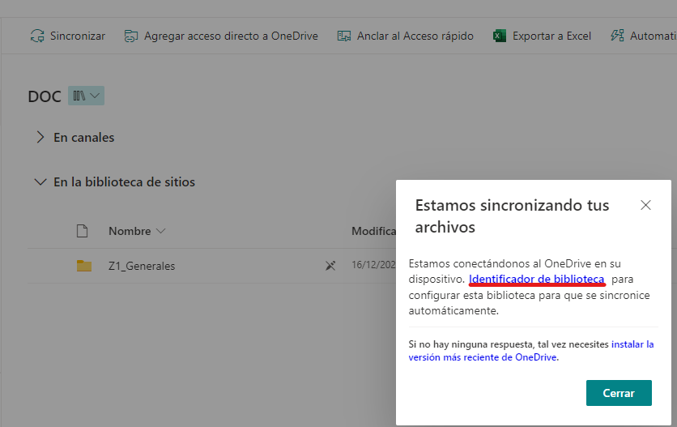

Una vez aparezca dicho mensaje, se debe hacer clic en "Identificador de biblioteca" para copiar el código.

Posteriormente, se procede a crear una directiva, esta vez seleccionando el "Tipo de perfil" como "Plantillas". Dentro de las plantillas, se busca "Plantillas Administrativas".

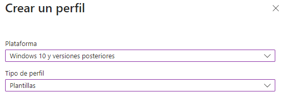

Los primeros pasos son los mismos que en el paso anterior el cambio lo veremos cuando lleguemos a esta parte.

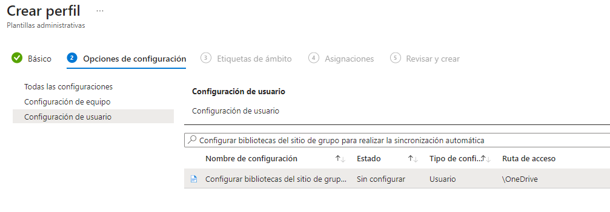
En esta sección, se debe buscar la opción "Configurar bibliotecas del sitio de grupo para realizar la sincronización automática". Es importante seleccionar "Usuario" en el tipo de configuración.

Al habilitar la configuración, se observará la aparición de dos campos: "Nombre" y "Valor". En el campo "Nombre", se debe ingresar un identificador descriptivo (este nombre no será el que se mantenga en la biblioteca). En el campo "Valor", se debe pegar el "Identificador de biblioteca" previamente copiado.

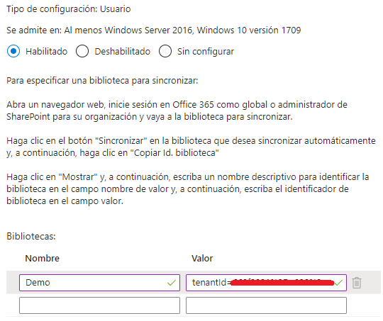

Una vez completado este paso, simplemente se debe hacer clic en "OK" y seguir los pasos anteriores para asignar esta configuración a grupos de usuarios.

### Acelerar el proceso de sincronización

Para agilizar el proceso de sincronización, se utiliza un script de PowerShell llamado Sync-SharepointFolder.ps ubicado en la carpeta Scripts. Este script ha sido tomado prestado de https://github.com/tabs-not-spaces/CodeDump/blob/master/Sync-SharepointFolder/Sync-SharepointFolder.ps1. Al ejecutar este script, se sincronizará automáticamente la carpeta de SharePoint deseada.

La sección del script relevante es la siguiente:
```
 $params = @{
        #replace with data captured from your sharepoint site.
        siteId    = "{00000000-0000-0000-0000-000000000000}"
        webId     = "{00000000-0000-0000-0000-000000000000}"
        listId    = "{00000000-0000-0000-0000-000000000000}"
        userEmail = $userUpn
        webUrl    = "https://example.sharepoint.com"
        webTitle  = "Title"
        listTitle = "FolderName"
    }
```
Para obtener estos datos, sigue los siguientes pasos:

Para obtener estos datos, sigue los siguientes pasos:

1. Abre el sitio de SharePoint que deseas sincronizar.
2. Presiona la tecla F12 para abrir las "Herramientas de desarrollo" o "DevTools".
3. Dirígete al apartado de "Network" (Red).
4. Haz clic en el botón "Detener la grabación de registro" para detener la captura de datos.
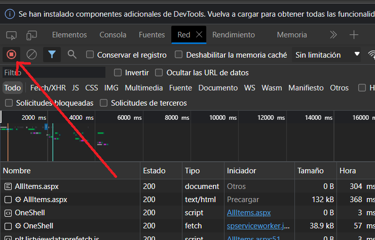
5. Limpia todo el registro para mantenerlo más limpio.
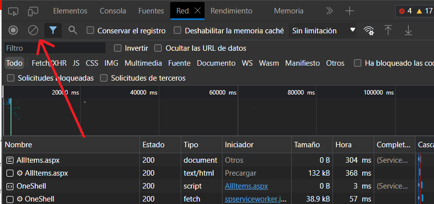
6. Inicia el registro de red.
7. Haz clic en el botón de sincronización en SharePoint.
8. Cancela la sincronización.


Al hacer clic en el botón de sincronizar, se generarán una serie de paquetes.

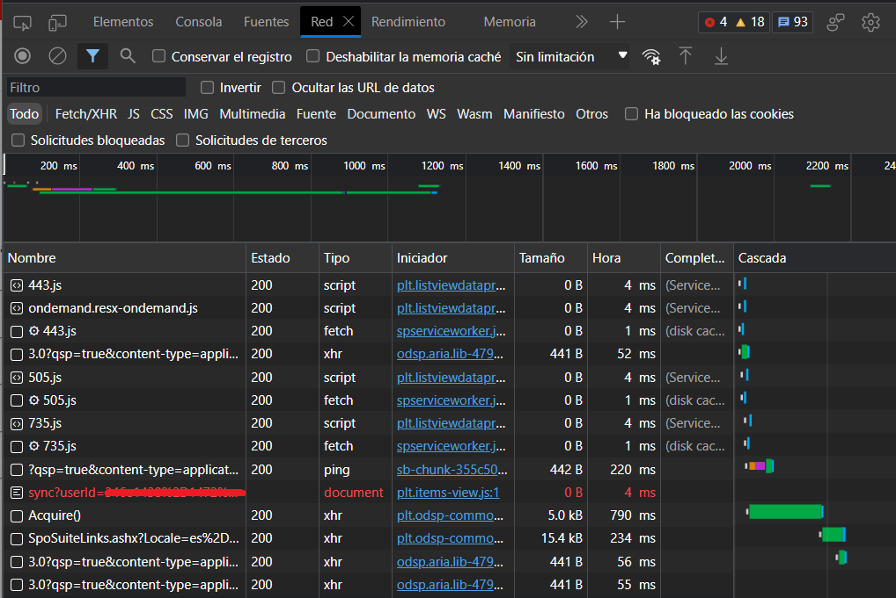
El paquete que nos interesa es aquel que comienza con **sync**. Al hacer clic en esa línea y dirigirnos al apartado de **payload**, podremos visualizar los datos que son requeridos por el script.

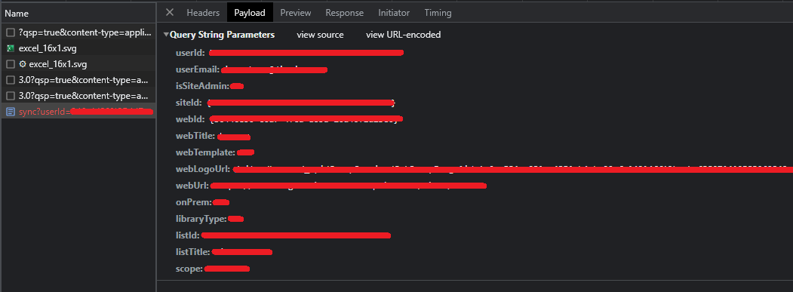

Ahora, los datos solicitados en el script deben ser sustituidos y estará listo para su uso.

## Wi-Fi

Para aplicar las credenciales de Wi-Fi, es necesario crear una nueva directiva de tipo Plantilla y seleccionar la opción de Wi-Fi.


Una vez que hayas seleccionado la opción de crear, el proceso será el mismo que antes hasta que llegues a esta etapa.

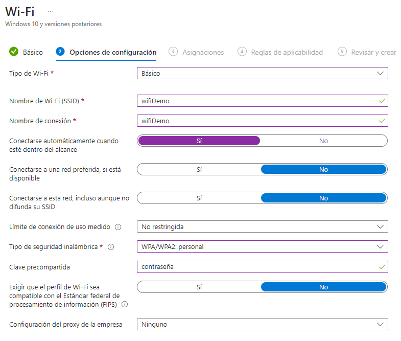

En esta sección, debes aplicar las configuraciones deseadas y proporcionar las credenciales del Wi-Fi correspondiente.

A partir de esta pestaña, el resto de las pestañas son similares a los pasos anteriores, excepto por la pestaña de **Reglas de aplicabilidad**. En esta sección, tienes la opción de restringir o asignar la directiva en función de la versión del sistema operativo o la edición del sistema operativo.
