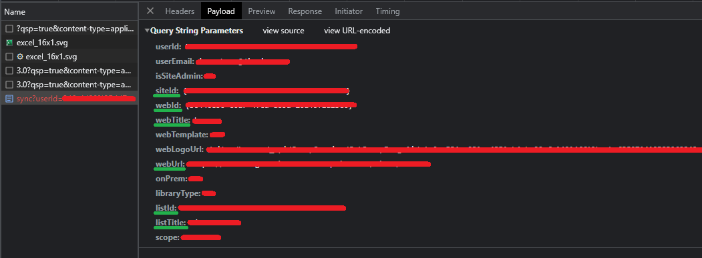
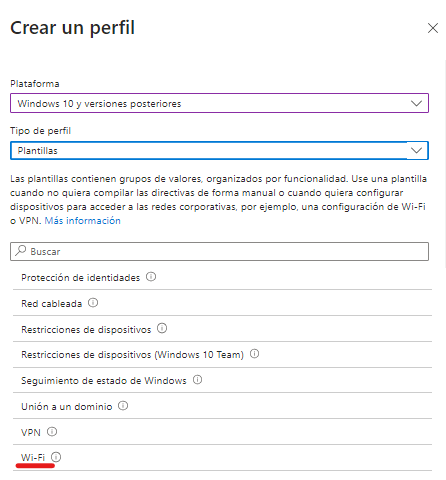

**Introducción: Configuración de Dispositivos**

En este documento, se proporciona una guía para configurar diferentes aspectos en los dispositivos utilizando las herramientas y directivas de Microsoft Intune. Se abordarán tres áreas principales: OneDrive, SharePoint y Wi-Fi.

La sección de OneDrive explora cómo lograr la sincronización automática de OneDrive mediante la creación de perfiles de configuración. Se detallará el proceso de configuración de opciones clave, como la sincronización automática de carpetas conocidas de Windows y la autenticación silenciosa de usuarios.

En la sección de SharePoint, se explicará cómo configurar automáticamente la sincronización de una biblioteca de SharePoint utilizando directivas de Intune. Además, se proporcionará una manera de acelerar el proceso de sincronización utilizando un script de PowerShell.

Por último, se abordará la configuración de Wi-Fi, donde se mostrará cómo aplicar las credenciales y configuraciones de red a través de directivas de Intune.

A través de estas instrucciones detalladas, podrás optimizar la configuración de tus dispositivos y aprovechar al máximo las capacidades Microsoft Intune

## Indice
- [ONE DRIVE](#one-drive)
- [OneDrive Sharepoint](#onedrive-sharepoint)
    - [Acelerar el proceso de sincronizacion](#acelerar-el-proceso-de-sincronizacion)
- [Wifi](#wi-fi)


Dispositivos | Configuración
https://endpoint.microsoft.com/#view/Microsoft_Intune_DeviceSettings/DevicesMenu/~/configuration

## ONE DRIVE

Para lograr la sincronización automática de OneDrive, es necesario aplicar las directivas. Para crear una directiva, accedemos al enlace ubicado en la parte superior y seleccionamos la opción "Crear Perfil".


Al seleccionar "Crear Perfil", aparecerá una ventana emergente en la cual debemos especificar los siguientes detalles: 

en el campo **Plataforma**, elegiremos "Windows 10 y versiones posteriores", y en el campo **Tipo de perfil**, seleccionaremos "Catálogo de configuración".


Una vez que hayamos configurado estas opciones, hacemos clic en "Crear" y pasaremos a la siguiente pantalla.

En esta etapa, ingresamos el nombre con el que deseamos identificar la directiva y proporcionamos una breve descripción.


ahora tenemos que pulsar en  **Agregar configuración** y buscar "OneDrive" en el buscador


En esta sección, debemos buscar las siguientes opciones:

- Silently move Windows known folders to OneDrive
- Silently sign in users to the OneDrive sync app with their Windows credentials
- Allow syncing OneDrive accounts for only specific organizations.
- Set the sync app update ring
- Use OneDrive Files On-Demand

Para configurar algunas de estas opciones, necesitaremos el **Tenant ID** de la organización. Para obtenerlo, simplemente accedemos al Active Directory y lo copiamos tal como se muestra en la imagen.


A continuación, explicaré brevemente para qué sirve cada opción y cómo se configura.


## Silently move Windows known folders to OneDrive

Esta configuración permite la sincronización automática de las carpetas de Escritorio, Documentos e Imágenes sin la intervención del usuario. Además, se puede mostrar una notificación para informar al usuario cuando estas carpetas se hayan sincronizado exitosamente.


Es importante poner el Tenant ID para la sincronizacion ya que si no, no se van a sincronizar las carpetas.


## Silently sign in users to the OneDrive sync app with their Windows credentials

Esta configuración te permite iniciar sesión de forma silenciosa a los usuarios en la aplicación de sincronización de OneDrive (OneDrive.exe) con sus credenciales de Windows. Si habilitas esta configuración, los usuarios que hayan iniciado sesión en el PC con la cuenta principal de Windows (la cuenta utilizada para unir el PC al dominio) podrán configurar la aplicación de sincronización sin tener que ingresar las credenciales de la cuenta. Los usuarios aún verán la configuración inicial de OneDrive para que puedan seleccionar las carpetas a sincronizar y cambiar la ubicación de su carpeta de OneDrive. Si un usuario está utilizando la aplicación de sincronización anterior de OneDrive for Business (Groove.exe), la nueva aplicación de sincronización intentará tomar el control de la sincronización de OneDrive del usuario desde la aplicación anterior y conservar los ajustes de sincronización del usuario. Esta configuración se utiliza con frecuencia junto con "Establecer el tamaño máximo de descarga automática de OneDrive para un usuario" en PC que no tienen "Archivos bajo demanda" y "Establecer la ubicación predeterminada de la carpeta de OneDrive". Si deshabilitas o no configuras esta configuración, los usuarios deberán iniciar sesión con su cuenta de trabajo o de estudios para configurar la sincronización.

## Allow syncing OneDrive accounts for only specific organizations. (no es indispensable)

Esta configuración te permite evitar que los usuarios suban fácilmente archivos a otras organizaciones al especificar una lista de ID de inquilinos permitidos. Si habilitas esta configuración, los usuarios recibirán un error si intentan agregar una cuenta de una organización no permitida. Si un usuario ya ha agregado la cuenta, los archivos dejarán de sincronizarse. Si deshabilitas o no configuras esta configuración, los usuarios podrán agregar cuentas de cualquier organización. Para bloquear organizaciones específicas, utiliza "Bloquear la sincronización de cuentas de OneDrive para organizaciones específicas". Esta configuración tendrá prioridad sobre "Bloquear la sincronización de cuentas de OneDrive para organizaciones específicas". No habilites ambas políticas al mismo tiempo.

## Set the sync app update ring (no es indispensable)

as actualizaciones de la aplicación de sincronización de OneDrive (OneDrive.exe) se lanzan al público a través de tres anillos: primero, Insiders; luego, Production; y finalmente, Deferred. Esta configuración te permite especificar la versión de la aplicación de sincronización para los usuarios de tu organización. Cuando habilitas esta configuración y seleccionas un anillo, los usuarios no podrán cambiarlo. Los usuarios en el anillo Insiders recibirán versiones que les permiten obtener un avance de las nuevas funciones que llegarán a OneDrive. Los usuarios en el anillo Production recibirán las últimas características a medida que estén disponibles. Los usuarios en el anillo Deferred recibirán las nuevas funciones, correcciones de errores y mejoras de rendimiento en último lugar. Este anillo te permite implementar actualizaciones desde una ubicación de red interna y controlar el momento de la implementación (dentro de una ventana de 60 días). Si deshabilitas o no configuras esta configuración, los usuarios recibirán las actualizaciones de la aplicación de sincronización de OneDrive cuando estén disponibles en el anillo Production. Los usuarios pueden unirse a los programas Office o Windows Insiders para recibir actualizaciones en el anillo Insiders.


## Use OneDrive Files On-Demand (no es indispensable)
Esta configuración te permite controlar si se habilita OneDrive Archivos bajo demanda para tu organización. Si habilitas esta configuración, OneDrive Archivos bajo demanda se activará de forma predeterminada. Si deshabilitas esta configuración, OneDrive Archivos bajo demanda se desactivará explícitamente y los usuarios no podrán activarlo. Si no configuras esta opción, los usuarios podrán activar o desactivar OneDrive Archivos bajo demanda.


------
Una vez que hayamos completado la configuración, procedemos a hacer clic en "Siguiente" hasta que lleguemos a la sección de Tareas.

Aquí, solo podremos asignar las directivas a grupos y no a usuarios específicos.


Al final del proceso, se mostrará un resumen detallado de todas las configuraciones realizadas.


## OneDrive Sharepoint 

A continuación, se explicará cómo configurar automáticamente una unidad de SharePoint utilizando las directivas de Intune.

**¡¡¡¡¡¡ ADVERTENCIA !!!!!!!**

lo primero que hay que saber es que por razones que desconozco estas directivas dardan 8 horas en aplicarse desde el que el usuario inicia sesion en el equipo.

luego explicare una manera de hacelerar la aplicacion de esta directiva.

lo primero que tenemos que hacer es ir a nuestro directorio de sharepoit que queremos sincronizar y pulsar en sincronizar pero sin sincronizar el directorio, lo que queremos es que salga el siguiente mensaje 


Una vez aparezca dicho mensaje, se debe hacer clic en "Identificador de biblioteca" para copiar el código.

Posteriormente, se procede a crear otra directiva, esta vez seleccionando el "Tipo de perfil" como "Plantillas". Dentro de las plantillas, se busca "Plantillas Administrativas".


los primeros pasos son los mismos que en el paso anterior el cambio lo veremos cuando lleguemos a esta parte.


aqui tenemos que buscar "Configurar bibliotecas del sitio de grupo para realizar la sincronización automática" es inportante que en tipo de configuracion ponga "Usuario" 

Al habilitar la configuración, notaremos que aparecerán dos campos debajo, denominados "Nombre" y "Valor". En el campo "Nombre", debemos ingresar un identificador descriptivo (este nombre no será el que se mantenga en la biblioteca). En el campo "Valor", pegaremos el "Identificador de biblioteca" que previamente hemos copiado.


Una vez completado este paso, simplemente hacemos clic en "OK" y seguimos los pasos anteriores para asignar esta configuración a grupos de usuarios.

### Acelerar el proceso de sincronizacion

Para agilizar el proceso de sincronización, se utiliza un script de PowerShell llamado Sync-SharepointFolder.ps ubicado en la carpeta Scripts. Este script ha sido tomado prestado de https://github.com/tabs-not-spaces/CodeDump/blob/master/Sync-SharepointFolder/Sync-SharepointFolder.ps1. Al ejecutar este script, se sincronizará automáticamente la carpeta de SharePoint deseada.

La sección del script que nos interesa es la siguiente:
```
 $params = @{
        #replace with data captured from your sharepoint site.
        siteId    = "{00000000-0000-0000-0000-000000000000}"
        webId     = "{00000000-0000-0000-0000-000000000000}"
        listId    = "{00000000-0000-0000-0000-000000000000}"
        userEmail = $userUpn
        webUrl    = "https://example.sharepoint.com"
        webTitle  = "Title"
        listTitle = "FolderName"
    }
```
para obtener estos datos los pasos son los siguientes:

1. Abrimos el sitio de SharePoint que deseamos sincronizar.
2. Presionamos la tecla F12 para abrir las "Herramientas de desarrollo" o "DevTools".
3. Nos dirigimos al apartado de "Network" (Red).
4. Hacemos clic en el botón "Detener la grabación de registro" para detener la captura de datos.

5. Limpiamos todo el registro para mantenerlo más limpio.

6. Iniciamos el registro de red.
7. Hacemos clic en el botón de sincronización en SharePoint.
8. Cancelamos la sincronizacion

al hacer click en el boton de sincronizar se generaran unos paquetes

el paquete que nos interesa es el que empieza por **sync** si hacemos click en esa linea y vamos al apartado de payload podremos ver los datos que nos pide el script. 


## Wi-Fi

Para poder aplicar las credenciales de Wi-Fi tenemos que crear una nueva directiva de tipo Plantilla y selecionar Wi-Fi


al darle a crear el proceso es el mismo de siempre hasra llegar aqui


aqui se aplican las configuraciones queremos aplicar y las credenciales del Wi-Fi.

Despues de esta pestaña todas las demas son igual que en los pasos anteriores menos la pestaña de **Reglas de aplicabilidad**. en este apartado se puede restringir o asignar tanto a la versinon del sistema operativo como a la Edicion del sistema operativo.
