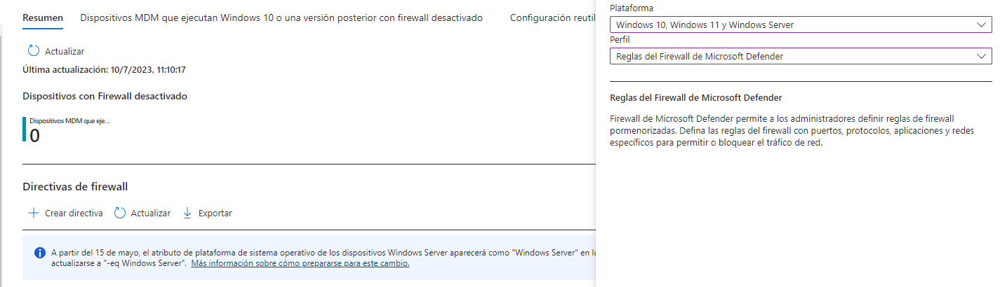
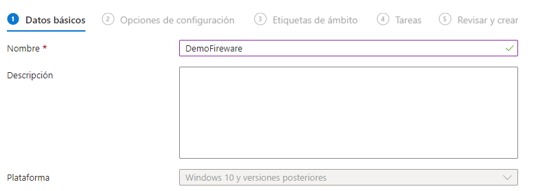
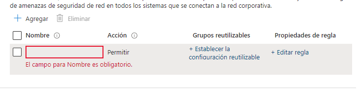
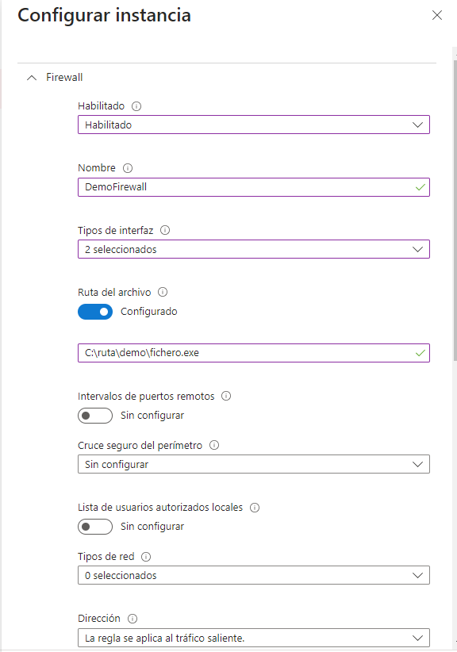
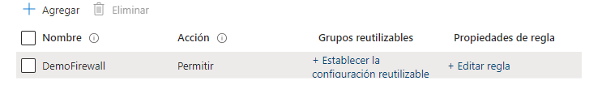
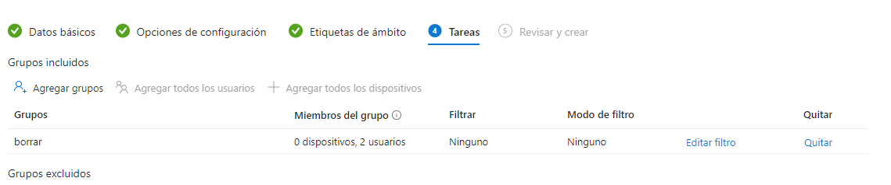
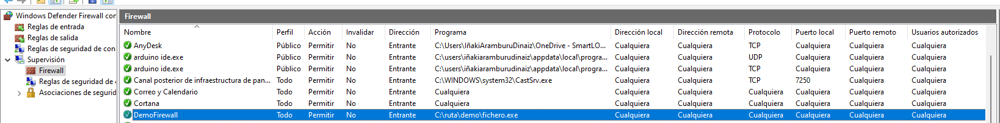

**Firewall Intune**
===
En esta sección se explicará cómo configurar el Firewall de Windows mediante Intune.

## **Pasos a seguir**

Se debe abrir el Centro de administración de Microsoft Intune y luego acceder a Seguridad de los puntos de conexión -> Firewall. En la pantalla resultante, se debe pulsar en **Agregar**.

Al pulsar el botón de agregar, se presentarán dos desplegables, Plataformas y Perfil.

en **Platarforma** selecionaremos "Windows 10, Windows 11 y Windows Server" y en **Perfil** "Reglas del Firewall de Microsoft Defender"

Después de seleccionar esas opciones y hacer clic en "Crear", se mostrará la siguiente pantalla donde se podrá establecer un nombre y una descripción.

Una vez se ha establecido el nombre y la descripción, aparecerá la siguiente pantalla.

Al hacer clic en "Editar regla", se desplegará el siguiente menú:

Dentro de este menú desplegable, se pueden establecer varias configuraciones, pero en este caso nos centraremos en los siguientes aspectos:

- **Habilitado**: Permite activar o desactivar la regla.
- **Nombre**: Permite asignar un nombre descriptivo a la regla.
- **Tipo de interfaz**: Permite especificar si la regla se aplicará a la interfaz inalámbrica, LAN u otra interfaz disponible.
- **Ruta del archivo**: Permite establecer la ubicación del archivo o la ruta a la cual se aplicará la regla.
- **Dirección**: Permite definir si la regla se aplicará para el tráfico de entrada.
- **Acción**: Especifica la acción que aplica la regla para bloquear o permitir el tráfico de red.

en este caso lo he configurado de la siguiente manera:
- **Habilitado**: Habilitado
- **Nombre**: DemoFirewall
- **Tipo de interfaz**: LAN, Inalámbrica
- **Ruta del archivo**: C:\ruta\demo\fichero.exe 
- **Dirección**: La regla se aplica al tráfico entrante.
-- **Acción**: Permitir

Aquí podemos observar cómo se ha creado la regla. Si seleccionamos "Agregar", podremos seguir agregando más reglas.

Luego, accedemos a la sección de Tareas y añadimos los grupos a los cuales queremos asignar la relación.

Posteriormente, una vez asignada la regla y al dirigirnos a la sección final, podremos visualizar un breve resumen de la configuración. Después de verificar que hemos configurado correctamente, hacemos clic en "crear" y esperamos a que se aplique. Si revisamos la lista en el Firewall de Windows, podremos observar que la regla aparece en ella.

