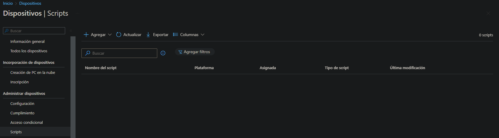
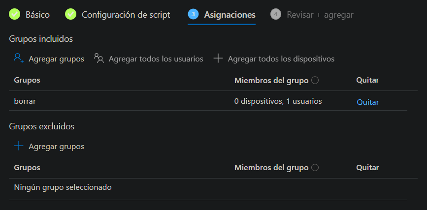

**Scripts en Intune**
===

Aquí se explicarán los pasos a seguir para agregar scripts en Intune para Windows 10 y versiones posteriores.

Además de eso, en la carpeta de **Scripts** contiene una explicación completa de las funciones de los scripts que he creado. Estos scripts automatizan diversas tareas en Windows 10 y versiones posteriores, como la configuración de plantillas de Word, el botón de Word, los complementos de Excel y el fondo de Teams.

## **Pasos a seguir**

Se debe abrir el Centro de administración de Microsoft Intune y luego acceder a Dispositivos -> Scripts. En la pantalla resultante, se debe pulsar en **Agregar**.

Al pulsar el botón de agregar, se presentarán tres opciones para seleccionar.

- Linux
- MacOS
- Windows 10 y versiones posteriores

Al tratarse de una guía para Windows 10, se seleccionará "Windows 10 y versiones posteriores".

## **Windows 10 y versiones posteriores**

 Cuando se hace clic en "Windows 10 y versiones posteriores", se deben seguir cuatro pasos:

  1. [Básico](#1-básico)
  2. [Configuración de script](#2-configuración-de-script)
  3. [Asignaciones](#3-asignaciones)
  4. [Revisar y agregar](#4-revisar-y-agregar)

### 1. Básico

En este paso, simplemente se debe ingresar un nombre para identificar el script, junto con una descripción opcional.

### 2. Configuración de script

  En este punto, se debe cargar el script creado en PowerShell. A continuación, aparecerán tres opciones para seleccionar:

- Ejecutar este script con las credenciales de inicio de sesión.
- Exigir comprobación de firma del script.
- Ejecutar el script en el host de PowerShell de 64 bits.

AVISO: En la actualidad, no se dispone de una opción para editar el script que se ha cargado en Intune. Sin embargo, es posible reemplazar completamente el script por uno nuevo. Ten en cuenta que no podrás editar líneas de código individuales ni visualizar el contenido del script una vez lo hayas cargado. Por lo tanto, es importante que cuentes con una copia de seguridad del script original en caso de que necesites realizar modificaciones en el futuro.

### 3. Asignaciones

El apartado de "Asignaciones" se divide en dos secciones: "Grupos incluidos" y "Grupos excluidos". Es importante tener en cuenta que al excluir grupos, no es posible mezclar usuarios y grupos de dispositivos utilizando las opciones de "include" y "exclude". [Haga clic aquí para obtener más información sobre cómo excluir grupos.](https://learn.microsoft.com/es-es/mem/intune/configuration/device-profile-assign#exclude-groups-from-a-profile-assignment)

En ese caso, al agregar el grupo "borrar" a los grupos incluidos, el script se aplicará únicamente al usuario que se encuentra en ese grupo, considerando que solo hay un usuario presente en él.

### 4. Revisar y agregar

En el último paso, se presenta un resumen de todos los pasos anteriores con el fin de brindar una vista rápida y verificar que todo esté correctamente configurado. Esto permite tener una visión general de los pasos realizados y asegurarse de que todo esté en orden antes de proceder.

