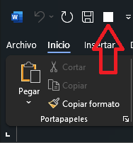

**Scripts**
===

Aquí explicare que hacen los scripts:
## Indice

- [botonWordDinaiz.ps1](#botonworddinaizps1)
- [excelComplemento(NO FUNCIONA).ps1](#excelcomplementono-funcionaps1)
- [fondoTeams.ps1](#fondoteamsps1)
- [plantillasDinaiz.ps1](#plantillasdinaizps1)

## botonWordDinaiz.ps1

Este script se utiliza para crear el botón que permite habilitar los scripts en Word.



Para automatizar dicho proceso, se debe copiar el contenido del archivo generado al exportar la configuración en Word. Es importante tener en cuenta que este enfoque presupone que ya se ha configurado Word previamente.

Para exportar la configuración, es necesario seguir los siguientes pasos:

(Ten en cuenta que estos pasos pueden variar ligeramente dependiendo de la versión de Word que estés utilizando.)

Archivo > opciones > Barra de herramientas de acceso Rápido > Importar o exportar

Después de exportar la configuración, simplemente se debe copiar el contenido del archivo recién exportado a la variable `$content`. A continuación, se crea un nuevo archivo con el mismo nombre que el archivo predeterminado "Word.officeUI" y se inserta el contenido de la variable en dicho archivo.

La ruta de la configuracion esta en:

```
C:\Users\$username\AppData\Local\Microsoft\Office\Word.officeUI
```

## excelcomplementono-funciona.ps1

 El siguiente script no funciona y no logro comprender la razón. Este script se encarga de agregar la ruta del complemento al registro de Windows.

## fondoTeams.ps1

Con este script, se automatiza la configuración del fondo de Teams para las llamadas. Es relevante mencionar que no se establece directamente el fondo, sino que se copia la imagen a la ruta donde Teams guarda las imágenes de fondos personalizados, de manera que el usuario final pueda seleccionarla.

La ruta en la que Teams guarda los fondos es:

```
C:\Users\$username\AppData\Roaming\Microsoft\Teams\Backgrounds\Uploads\
```

## plantillasDinaiz.ps1

Con este script, se realiza un cambio en el registro. `HKCU:\Software\Microsoft\Office\16.0\Common\General\UserTemplates` y `HKCU:\Software\Microsoft\Office\16.0\Common\General\SharedTemplates` para que las macros en Word funcionen. Cambiando estos registros estamos cambiando los campos de `Plantillas personalizadas` y `Plantillas de grupo`.

Con este script, se realiza un cambio en el registro de dos ubicaciones específicas:

1. `HKCU:\Software\Microsoft\Office\16.0\Common\General\UserTemplates`
2. `HKCU:\Software\Microsoft\Office\16.0\Common\General\SharedTemplates`

Estos cambios se realizan para asegurar el correcto funcionamiento de las macros en Word. Al modificar estos registros, se están cambiando los valores de los campos "**Plantillas personalizadas**" y "**Plantillas de grupo**".
