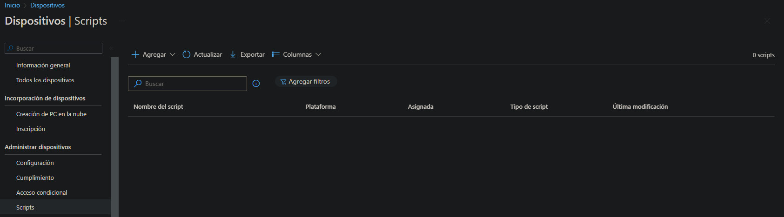
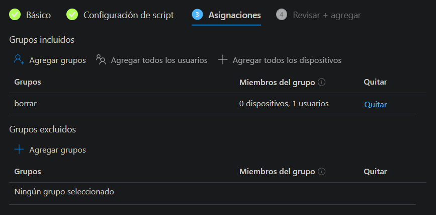

**Scripts en Intune**
===
Aquí te explicaré los pasos a seguir para agregar scripts en Intune:

## **Requisitos** 
- Tener una licencia de Microsoft Intune

## **Pasos a seguir**

  Tenemos que habrir el Centro de administracion de Microsoft Intune y despues ir a Dispositivos -> Scripts

 llegaremos a una pantalla como y esta pulsamos en **Agregar** 

Al pulsar el botón de agregar, aparecerán tres opciones para seleccionar.

- Linux
- macOS
- Windows 10 y versiones posteriores

##  **Windows 10 y versiones posteriores**
  Cuando pulsemos en "Windows 10 y versiones posteriores" tenemos que seguir 4 pasos que son: 
  1. [Básico](#1-básico-basico)
  2. [Configuración de script](#2-configuración-de-script-configuracion-de-script)
  3. [Asignaciones](#3-asignaciones-asignaciones)
  4. [Revisar y agregar](#revisar-y-agregar)
  ### 1. Básico
 En este paso simplemente hay que meter el nombre para identificar el script junto a una descripción opcional.
 
  ### 2. Configuración de script
  En este punto hay que subir el script que hemos creado en Powershell y luego nos saldra 3 opciones para selecionar 
- Ejecutar este script con las credenciales de inicio de sesión
- Exigir comprobación de firma del script
- Ejecutar script en host de PowerShell de 64 bits

AVISO: En este momento, no hay opción para editar el script que se ha subido en Intune. Sin embargo, tienes la posibilidad de reemplazar el script completo por otro nuevo. Ten en cuenta que no podrás editar líneas de código individuales ni visualizar el contenido del script una vez lo hayas subido. Por lo tanto, asegúrate de tener una copia de seguridad del script original en caso de que necesites hacer cambios en el futuro.

### 3. Asignaciones
El apartado de "Asignaciones" se divide en dos secciones: "Grupos incluidos" y "Grupos excluidos". Es importante tener en cuenta que al excluir grupos, no es posible mezclar usuarios y grupos de dispositivos utilizando las opciones de "include" y "exclude". [Haga clic aquí para obtener más información sobre cómo excluir grupos.](https://learn.microsoft.com/es-es/mem/intune/configuration/device-profile-assign#exclude-groups-from-a-profile-assignment)

En ese caso, al agregar el grupo **borrar** a los grupos incluidos, el script se aplicará únicamente al usuario que se encuentra en ese grupo, dado que solo hay un usuario presente en el mismo.

### 4. Revisar y agregar
En el último paso, se presenta un resumen de todos los pasos anteriores con el fin de brindar una vista rápida y verificar que todo esté correctamente configurado. Esto permite tener una visión general de los pasos realizados y asegurarse de que todo esté en orden antes de proceder.

